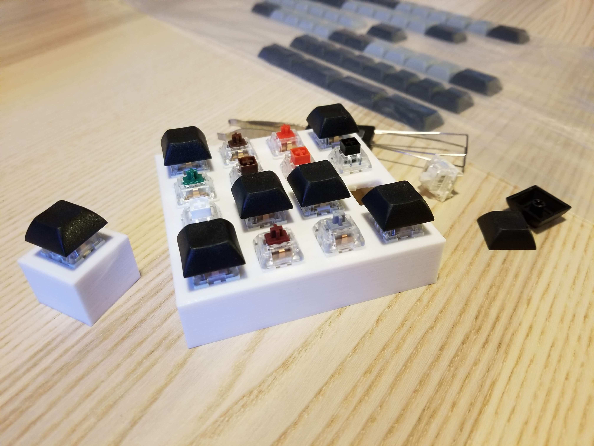

# Parameterized Key Tester Frame



This Python app allows you to generate `.scad` and `.stl` files for key tester frames, supporting
arbitrary `m x n` sizes.

In the `files/` directory, example output files for 1x1, 2x2, 3x3, and 4x4 sizes are included.


## Usage

You can generate other sizes using the `src/generate.py` script; example:

```bash
src/generate.py 3 5 --output ~/key-tester-3x5.scad
```

Once you have generated a `.scad` file, you can use OpenSCAD to generate a `.stl` file from it:

```bash
openscad -o ~/key-tester-3x5.stl ~/key-tester-3x5.scad
```


## License

This project is released under [the BSD 3-Clause License](https://opensource.org/licenses/BSD-3-Clause).
